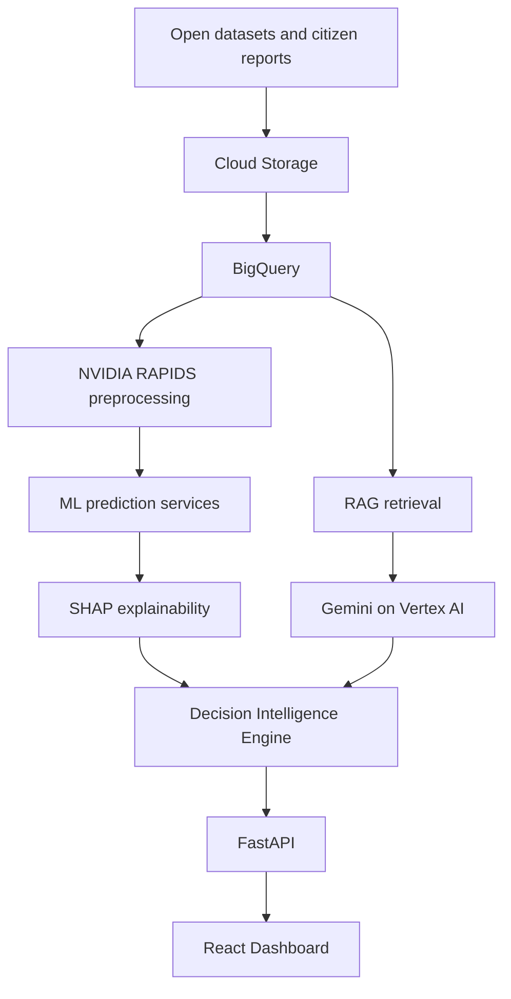

# EcoMind AI
AI Decision Intelligence Platform for Climate Resilience & Disaster Preparedness.

EcoMind AI is built for the Google Cloud + NVIDIA Hackathon. It is not a weather dashboard. It combines risk prediction, explainable AI, Gemini-style reasoning, citizen reports, resource planning, maps and operational recommendations into one decision workspace.

## Table of Contents
- [What It Demonstrates](#what-it-demonstrates)
- [Quick Start](#quick-start)
- [Demo Flow](#demo-flow)
- [Architecture](#architecture)
- [Folder Structure](#folder-structure)
- [Production Notes](#production-notes)

## What It Demonstrates
- React + TypeScript + Vite frontend with maps, charts, assistant UI, dark mode and operational dashboards.
- FastAPI backend with health, risk, prediction, alert, citizen report and AI assistant APIs.
- Gemini/Vertex AI, BigQuery, Cloud Storage and Firebase-ready service boundaries.
- NVIDIA RAPIDS-ready ML pipeline patterns with CPU vs GPU benchmark reporting.
- RAG prompt construction for grounding answers in risk forecasts and citizen reports.
- Docker, Docker Compose, Terraform stubs and deployment documentation.

## Quick Start
```bash
cp .env.example .env
npm install
npm --prefix frontend install
npm --prefix frontend run dev
```
In another terminal:
```bash
python -m venv .venv
.venv\Scripts\activate
pip install -r backend/requirements.txt
uvicorn backend.app.main:app --reload --port 8000
```
Open `http://localhost:5173` and API docs at `http://localhost:8000/docs`.

## Demo Flow
1. Start on the dashboard and show the city-level decision brief.
2. Click high-risk map zones to reveal why risk exists and what actions are recommended.
3. Ask the Gemini Decision Assistant: "Which wards are likely to flood tomorrow?"
4. Show SHAP factors to explain the prediction.
5. Upload a citizen report and show extraction of disaster type, severity, urgency and location.
6. Show the RAPIDS benchmark panel to communicate GPU acceleration.

## Architecture


## Folder Structure
```text
frontend/        React, TypeScript, Tailwind, Leaflet, Recharts
backend/         FastAPI, Pydantic, services, APIs, tests
ml/              Training and synthetic data scripts
prediction/      Inference entry points
recommendation/  Decision intelligence logic notes
rag/             RAG pipeline documentation
embeddings/      Embedding index notes
config/          Data schemas
docker/          Dockerfiles
terraform/       Google Cloud infrastructure scaffold
docs/            Architecture, deployment and API documentation
```

## Production Notes
The local project uses deterministic synthetic data so it runs without cloud credentials. To connect production services, set the values in `.env`, enable Vertex AI, create a BigQuery dataset, configure Firebase Authentication, and deploy the backend/frontend to Cloud Run.
