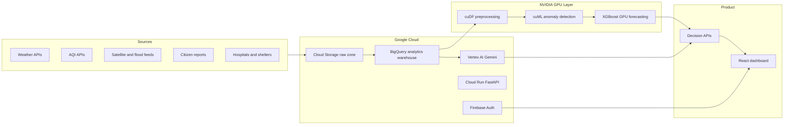
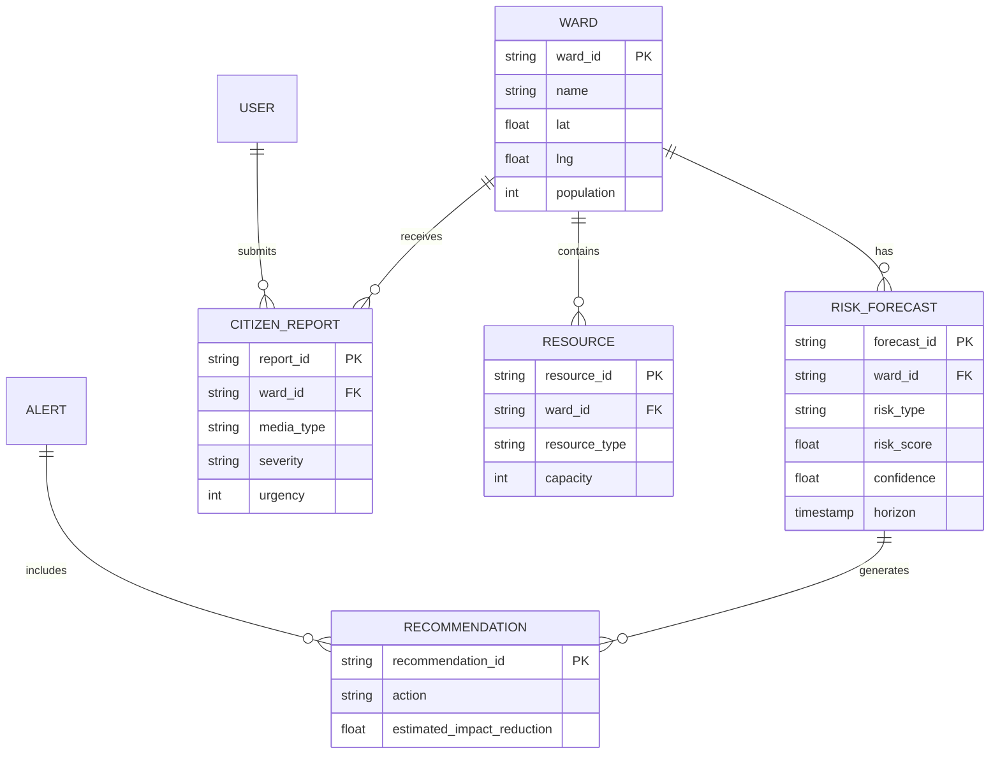

# Architecture

## System Design

## Decision Intelligence Loop

1. Collect raw climate, environmental, infrastructure and citizen signals.
2. Clean and enrich features with geospatial, temporal and infrastructure context.
3. Predict risks across flood, AQI, heatwave, emergency demand and hospital load.
4. Explain predictions with SHAP-style factor ranking.
5. Generate actions through the decision engine and Gemini.
6. Present actions, confidence, tradeoffs and estimated impact reduction.

## ER Diagram

